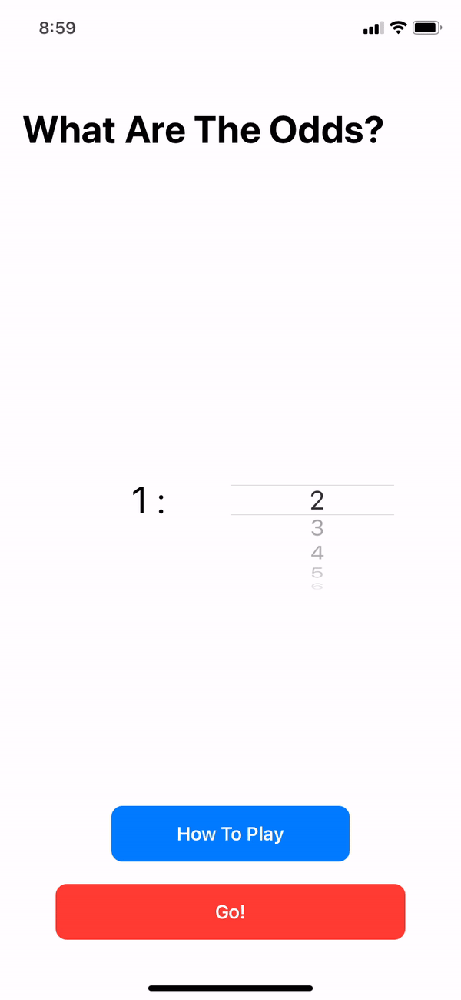

# What Are The Odds? - iOS

> What are the odds is a fun game where one person dares another to do something, asking what the odds are that they'll do it. This app then generates 2 random numbers between 1 and the chosen number. If the numbers are the same, the person must do the dare!

## Quick Demo

## Requirements

-   Swift 5
-   xCode 11.3.1
-   iOS 13.0

## Notes
**Programmatic UI**  The project uses programmatic UI rather than Storyboards. It also uses a customized button class inheriting from UIButton.

**Release**  There is no published version of this app as of now (5/9/2020). My intention is to submit it to the App Store shortly.

**Dependencies**  The project uses no third party libraries

**Background**  This project was originally developed as an Android app in late 2018.

## Contributing and License
This project is built and maintained by  [Jeff Morhous](http://jeffmorhous.com/)  as a demo of iOS development skills. It will soon be available on the App Store. No contributions will be accepted, as the intention of the project is to exhibit my own code. Feedback is always appreciated 👨‍🔬
